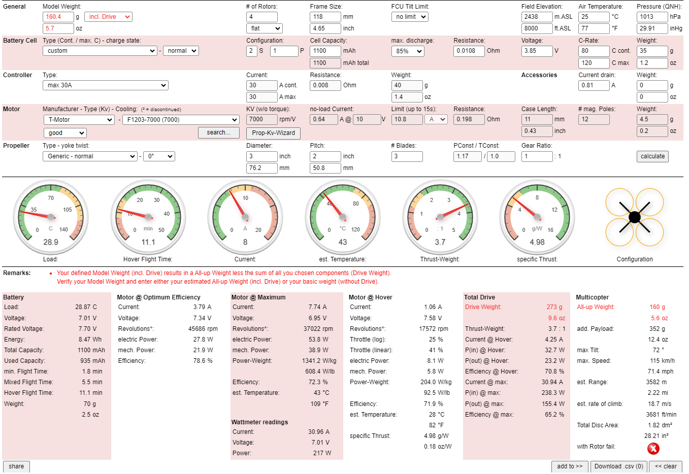

# WCU_Drones
Documentation and Code for Western CU's indoor Drone Project 

# Project Documentation

## Contents

1. [Basic Build + Ecalc Performance Predictions](#1-basic-build--ecalc-performance-predictions)
2. [Physical Assembly](#2-physical-assembly)
   - [Wiring FC to Raspberry Pi, ESC, and FPV Camera](#2a-wiring-fc-to-raspberry-pi-esc-and-fpv-camera)
   - [Wiring ESC to Battery Connector, and Motors](#2b-wiring-esc-to-battery-connector-and-motors)
   - [Installing Button on Raspberry Pi](#2c-installing-button-on-raspberry-pi)
3. [Firmware Setup/Installation](#3-firmware-setupinstallation)
   - [Flashing Flight Controller](#3a-flashing-flight-controller)
   - [Configuring ESC](#3b-configuring-esc)
   - [Setting up Raspberry Pi](#3c-setting-up-raspberry-pi)
4. [Initial Setup/Config](#4-initial-setupconfig)
   - [Setting up Pi as an Antenna](#4a-setting-up-pi-as-an-antenna)
   - [Initial FC Calibration/Config](#4b-initial-fc-calibrationconfig)
   - [Failsafes](#4c-failsafes)
5. [Manual Control](#5-manual-control)
   - [PyMavlink + Mavproxy](#5a-pymavlink--mavproxy)
   - [Using Manual Control](#5b-using-manual-control)

---

## 1. Basic Build + Ecalc Performance Predictions
## Basic Build + Ecalc Performance Predictions

This section provides a summary of the predicted performance for the drone based on the part weights, power draw, and simulated metrics provided by eCalc.

### Part Weights and Power Draw Summary

- **Total Weight**: 160 grams
- **Power Draw**: 0.810 amps

These values are the sum of all individual component weights and the estimated power draw based on the build specifications.

### eCalc Performance Simulation

Based on the eCalc simulation, the key takeaways are:

- **Thrust-to-Weight Ratio**: Approximately 5, indicating sufficient thrust to be airborne.
- **Estimated Flight Time**: Between 11-12 minutes, which falls within the desired range for the drone's intended use.
- **Overall Status**: All indicators are within the green zone, signifying optimal performance under the specified conditions.

It is important to note that while eCalc's predicted total weight for the drone is higher than the actual, this discrepancy is due to the use of generic parts for estimation purposes. Since the 'including drive' option for the all-up weight is selected, the actual build's performance may vary slightly from the simulation.

The graph above illustrates the relationship between throttle input and various performance metrics such as flight time and efficiency. This visualization aids in understanding how changes in throttle impact the drone's performance.

### Remarks on eCalc Predictions

While eCalc provides a valuable estimate for performance, it is essential to conduct real-world tests to validate these predictions. The actual performance can be influenced by factors not accounted for in the simulation, such as environmental conditions and real-world loading scenarios.

## 2. Physical Assembly
### 2a. Wiring FC to Raspberry Pi, ESC, and FPV Camera
> Content goes here

### 2b. Wiring ESC to Battery Connector, and Motors
> Content goes here

### 2c. Installing Button on Raspberry Pi
> Content goes here

## 3. Firmware Setup/Installation
### 3a. Flashing Flight Controller
> Content goes here

### 3b. Configuring ESC
> Content goes here

### 3c. Setting up Raspberry Pi
> Content goes here

## 4. Initial Setup/Config
### 4a. Setting up Pi as an Antenna
> Content goes here

### 4b. Initial FC Calibration/Config
> Content goes here

### 4c. Failsafes
> Content goes here

## 5. Manual Control
### 5a. PyMavlink + Mavproxy
> Content goes here

### 5b. Using Manual Control
> Content goes here
